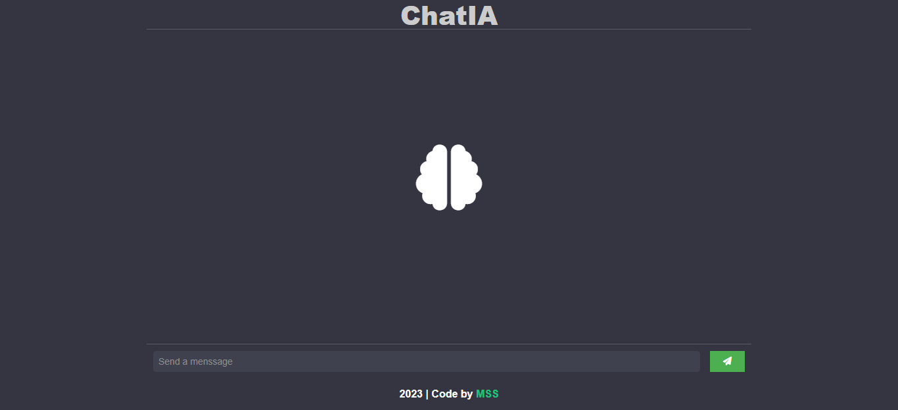
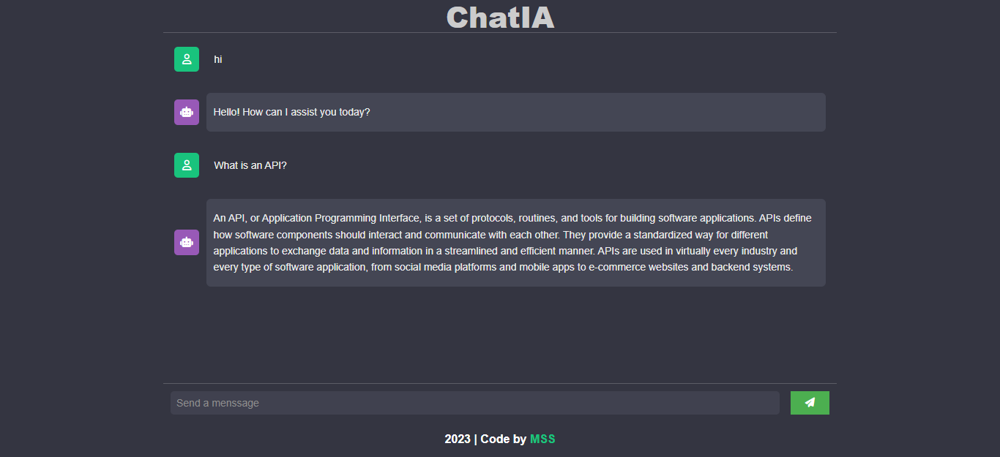

#   ChatIA Bot

**This example shows the creation of a themed ChatBot similar to ChatGPT**

### [API ChatGPT](https://rapidapi.com/search/chatgpt)
In **Collections** [Popular APIs](https://rapidapi.com/openai-api-openai-api-default/api/openai80/)

## View
### Start

### Making Request

